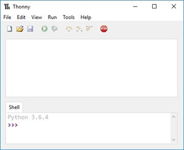

### CSCI 141
## Fall 2024
## Lab 2: Introduction to Python and the Thony IDE

# Introduction and preliminaries
The purpose of this lab is meant to introduce you to Python and Thonny. Lecture this week talks about what programming is about and shows a few examples of very short Python programs. In this lab, you’ll get your computer set up for this quarter, and get and introduction to writing and running your own Python program.
Since there’s a wide variety of backgrounds in this class, everyone will progress at different speeds through this lab - that’s ok! You should have enough time to complete this lab during the lab session. If you do not, be sure to upload your submission to Canvas by the due date. If you have questions, be sure to ask the TA. Ask questions often. Labs are your opportunity to get personalized help!

# Log into you the lab computers
The CS labs have been upgraded recently! Read about your account and files storage here: [[https://support.cs.wwu.edu/home/survival_guide/day_to_day/Accounts_Passwords_and_Profile_Storage.html]] . If you have registered for the class fewer than 24 hours ago, talk to your TA about getting access for the day. All the labs assigned for CSCI 141 boot into Linux - learning to use it is a course goal so take the time to dive in! You can find a user guide here: [[https://help.ubuntu.com/stable/ubuntu-help/]].

# Notation
In our class materials, we'll often give instructions about what Python code to use. This could show up 'in line' like this: `print("Hello World!")` or it may be displayed in a code block, like this: 
```
  def print_hello():
    print("Hello World!")
```
We will also sometimes indicate where you are to fill in some information by using the angle brackets < and > - for example `print("My name is <name>") `. If you have questions about this notation ask your TA for clarification.

# Create folders.
In addition to having office365, every student in a CS class gets account storage on our file servers, so you can access your files from any computer in the lab. Keeping your files organized is important! I recommend making a CSCI141 folder and a folder for each lab inside of that. Pay carefull attention in this class to instrucions on file names, and decide on a way to back files up in case of any disaster (copy them into your office365 drive perhaps?). When you are at home you can remotely log into the lab computers using a VPN - see the instructions at [[https://support.cs.wwu.edu/home/access/quickstart.html]] .

# Getting Started with Thonny

We’ll use Thonny as our IDE: integrated Development Environment - a fancy way of saying a program to program in. You can download it for free from [[http://www.thonny.org]] . The lab machines all have Thonny installed already. If you want to use it on your own computer, you can download it for free from [[http://www.thonny.org]] . Once you’ve logged into a lab machine, start Thonny - you can see several ways to start applications in Ubuntu Linux on this page: [[https://help.ubuntu.com/stable/ubuntu-help/shell-apps-open.html.en]]. 

If there are multiple versions of Thonny, use the most recent version that is installed. If you’ve launched Thonny correctly, a screen similar to what is shown belowin Figure 1 should appear. Don’t worry if the version number after ”Python” in the Shell tab differs; as long as the major (first) version number is 3, you’re in good shape.



There are two different ways that Thonny can be used. You can use the interpreter (or shell) directly, which will cause each line of code that you type into the Shell section to be executed after you press return, or you can create and save a Python program file, and then run (execute) the file in its entirety. Because you’ll be submitting your python program via Canvas, all instructions in labs and homework assignments will ask you to save a Python program file.

Select New from the File menu, which will begin a new file. Then select Save As from the file menu, and save your file as <lastNamefirstName> lab1.py in your lab1 folder.

As a first step, you’ll recreate the quintessential Hello World program that we saw in class. An important part of programming well is placing comments throughout your code to document your work. Comment lines among Python code are ignored and not executed when the program is run. To insert a comment, begin the line with a hash (or pound) symbol, #. You saw in lecture how to use the print function to output text to the console.

# Hello World
Type the following into the editor window of python (edit your file) the following (use your name and the current date):

```
#Author: Dr. Caroline Hardin
#Date: September 20, 2024
#Description: Code for Lab 1, CSCI
print("Hello World!")
```

Notice how the IDE colors different parts your code differently. Comments are grey, and the words Hello World, which are enclosed in double quotes, are colored green, to signify that those words are a string literal. You’ll learn more about strings later in the course, but now just think of it as text: the double quotes tell Python that what’s inside them shouldn’t be interpreted as more code, but as a piece of data representing some text.

That’s it! Your first python program. It contains comments (which will be ignored by the python interpreter), and a single use of the print function, which will print the phrase Hello World to the console.

Save your program to your lab1 folder (File ->Save as..., Ctrl+S), then run the program by either selecting Run Current Script from the Run menu, click on the green circle with the right-pointing arrow, or press the F5 button on your keyboard. If your code has no syntax errors, you should get something that is similar to the what is shown in Figure 2.


