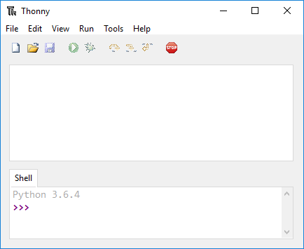
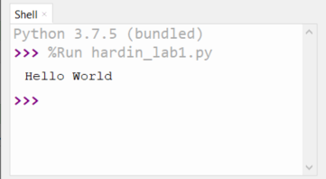
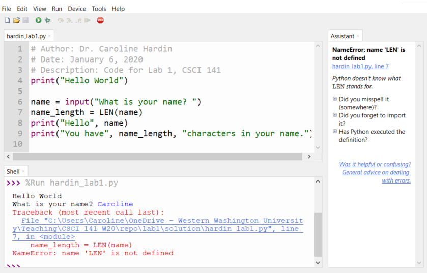

### CSCI 141
## Fall 2024
## Lab 2: Introduction to Python and the Thony IDE

# Introduction and preliminaries
The purpose of this lab is meant to introduce you to Python and Thonny. Lecture this week talks about what programming is about and shows a few examples of very short Python programs. In this lab, you’ll get your computer set up for this quarter, and get an introduction to writing and running your own Python program.
Since there’s a wide variety of backgrounds in this class, everyone will progress at different speeds through this lab - that’s ok! You should have enough time to complete this lab during the lab session. If you do not, be sure to upload your submission to Canvas by the due date. If you have questions, be sure to ask the TA. Ask questions often. Labs are your opportunity to get personalized help!

# Log into you the lab computers
The CS labs have been upgraded recently! Read about your account and files storage here: [[https://support.cs.wwu.edu/home/survival_guide/day_to_day/Accounts_Passwords_and_Profile_Storage.html]] . If you have registered for the class fewer than 24 hours ago, email cs.support@wwu.edu (or visit them in CF 412) and we will get it sorted out right away. All the labs assigned for CSCI 141 boot into Linux - learning to use it is a course goal so take the time to dive in! You can find a user guide here: [[https://help.ubuntu.com/stable/ubuntu-help/]].

# Notation
In our class materials, we'll often give instructions about what Python code to use. This could show up 'in line' like this: `print("Hello World!")` or it may be displayed in a code block, like this: 
```
  def print_hello():
    print("Hello World!")
```
We will also sometimes indicate where you are to fill in some information by using the angle brackets < and > - for example `print("My name is <name>") `. If you have questions about this notation ask your TA for clarification.

# Create folders.
In addition to having office365, every student in a CS class gets account storage on our file servers, so you can access your files from any computer in the lab. Keeping your files organized is important! I recommend making a CSCI141 folder and a folder for each lab inside of that. Pay carefull attention in this class to instrucions on file names, and decide on a way to back files up in case of any disaster (copy them into your office365 drive perhaps?). When you are at home you can remotely log into the lab computers using a VPN - see the instructions at [[https://support.cs.wwu.edu/home/access/quickstart.html]] .

# Getting Started with Thonny

We’ll use Thonny as our IDE: integrated Development Environment - a fancy way of saying a program to program in. You can download it for free from [[http://www.thonny.org]] . The lab machines all have Thonny installed already. If you want to use it on your own computer, you can download it for free from [[http://www.thonny.org]] . Once you’ve logged into a lab machine, start Thonny - you can see several ways to start applications in Ubuntu Linux on this page: [[https://help.ubuntu.com/stable/ubuntu-help/shell-apps-open.html.en]]. 

If there are multiple versions of Thonny, use the most recent version that is installed. If you’ve launched Thonny correctly, a screen similar to what is shown belowin Figure 1 should appear. Don’t worry if the version number after ”Python” in the Shell tab differs; as long as the major (first) version number is 3, you’re in good shape.



There are two different ways that Thonny can be used. You can use the interpreter (or shell) directly, which will cause each line of code that you type into the Shell section to be executed after you press return, or you can create and save a Python program file, and then run (execute) the file in its entirety. Because you’ll be submitting your python program via Canvas, all instructions in labs and homework assignments will ask you to save a Python program file.

Select New from the File menu, which will begin a new file. Then select Save As from the file menu, and save your file as <lastNamefirstName> lab1.py in your lab1 folder.

As a first step, you’ll recreate the quintessential Hello World program that we saw in class. An important part of programming well is placing comments throughout your code to document your work. Comment lines among Python code are ignored and not executed when the program is run. To insert a comment, begin the line with a hash (or pound) symbol, #. You saw in lecture how to use the print function to output text to the console.

# Hello World
Type the following into the editor window of python (edit your file) the following (use your name and the current date):

```
#Author: Dr. Caroline Hardin
#Date: September 20, 2024
#Description: Code for Lab 1, CSCI
print("Hello World!")
```

Notice how the IDE colors different parts your code differently. Comments are grey, and the words Hello World, which are enclosed in double quotes, are colored green, to signify that those words are a string literal. You’ll learn more about strings later in the course, but now just think of it as text: the double quotes tell Python that what’s inside them shouldn’t be interpreted as more code, but as a piece of data representing some text.

That’s it! Your first python program. It contains comments (which will be ignored by the python interpreter), and a single use of the print function, which will print the phrase Hello World to the console.

Save your program to your lab1 folder (File ->Save as..., Ctrl+S), then run the program by either selecting Run Current Script from the Run menu, click on the green circle with the right-pointing arrow, or press the F5 button on your keyboard. If your code has no syntax errors, you should get something that is similar to the what is shown in Figure 2.



# Input, Len, and variables

One important feature of most programs is that they somehow interact with the user and allow the user to input data. The input function in Python is one way to accomplish this: the program to prompts the user and then waits for some input to be entered using the keyboard.

We can call input function with no arguments to effectively pause the program until the user presses enter, as in `input()`

If we provide a string as an argument to input, it will print the string as a prompt before waiting for input.

Once the user provides input, you’ll often want the program to to store whatever the user entered somewhere in memory so that you can refer to that data when needed. Programming languages rely on variables as place holders that “remember” where a piece of data is stored in the computer. The concept of a variable will be discussed extensively in lecture. For the time being, think of a variable as an easy-to-remember name for a piece of data. To set the value of a variable use the assignment operator, `=`. To remind yourself that `=` means the variable on left gets set to a new value, pronounce `=` as ‘gets’.

You’ve learned the basic use of two functions so far: `input` and `print`. Here’s another one: the `len` function, which is short for length, calculates the length (number of characters) of its argument (i.e., whatever is inside the parentheses to the right of `len`).

Add the lines of code below to your Python program. Type the text exactly—double quotes, commas, parentheses, line breaks, etc. – all of it:
  ```
  name = input("What is your name? ")
  name_length = len(name)
  print("Hello", name)
  print("You have", name_length, "characters in your name.")
```
When executed, the four lines of code print to the console What is your name?, and then wait for the user’s input. Once the user provides input and presses return (enter), then the user’s input is placed into the variable name. The `len` function is invoked to calculate the length of the data in the variable name. The output of the `len` function is placed into the variable name length. The second-to-last print function causes the program to print the phrase Hello followed by the value that is stored in the variable name. Lastly, the count of characters in the user’s name (as calculated by the `len` function) is also output to the console.

Run your program. If your code has no syntax errors, you should get something that is similar to what is in Figure 3.


# Errors

Learning how to code means being able to find and fix syntax errors. Moreover, even if your python code has correct syntax, there may be other errors that may cause the program to crash. Knowing how to read error messages is an important skill because they inform you where in the code there is an error.

In this section, you’ll introduce some syntax errors on purpose to get familiar with what you’ll see when something goes wrong. Intentionally change print to printt, or len to LEN, or omit the parentheses around What is your name in the call to the print function. Any of these will generate an error when the program is run.

Save and run your program, and look at the red error message. A sample output is provided in (Figure 4). Assuming you had mistyped your code unintentionally, what information does the error message provide that you can use to troubleshoot your code? Notice that the error message tells you what line of code has the problem. Moreover the python interpreter tells you what exactly on a specific line of code it could not understand.



Play around with small modifications to your code and get a feel for the different error messages. There are many, many rules about what is valid Python syntax. You will see lots of examples of correct Python code (and you’ll encounter your fair share of incorrect code, as well!), but many questions are best answered by trying things out. Get creative about adding or removing spaces and newlines, changing capitalization, and so on. This would be a great task to work on with the person sitting next to you.

When you get an error message, pay close attention to how to interpret what the error messages say about where the error is coming from. This will come in very useful later, when you need to locate an error you’ve made unintentionally! You’ll also notice that Thonny provides some helpful suggestions for locating the error in the Assistant panel on the right. Getting errors, reading them, and then fixing them is a big part of writing code for novice and expert programmers alike!

# Submission
That’s it for this week’s lab—don’t worry if this seemed simple: future labs will be more involved.
Before you submit, undo the errors in your code so that your python program runs correctly. Save your .py file, and upload it to Canvas. For this lab, Canvas has been configured to permit only .py submissions. If you have never used Canvas, log into your canvas account, proceed to CSCI141, and you should see an option for items that are open for submission. Click on Lab 1, and select to upload a file. You can submit as many times as you like - we will only grade the latest one: wise students know to submit early and often to protect against lost files, accidentally missed deadlines, and other minor (but common) problems.

# Rubric
|Item  | points|
|---------------------------------------------------------------------|--------------|
|Top of program file contains comments, including your name	|2 points|
|The program does not contain any syntax errors and runs as intended	|3 points|
|The program uses input, len, and print|5 points|
|Total	|10 points|


