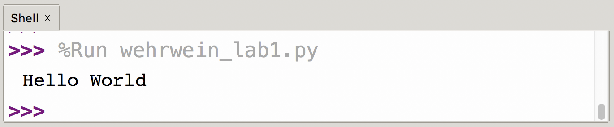
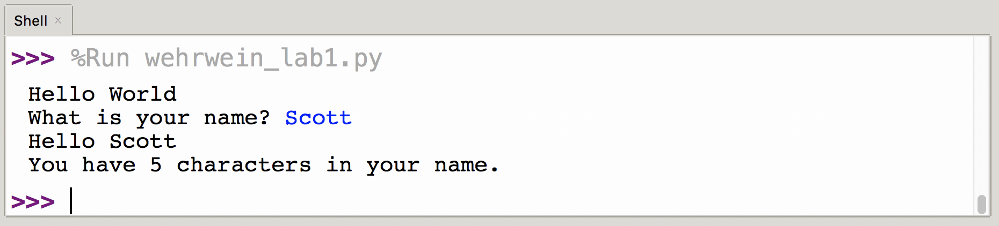
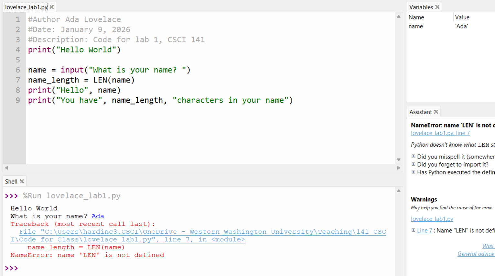
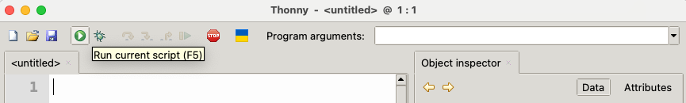
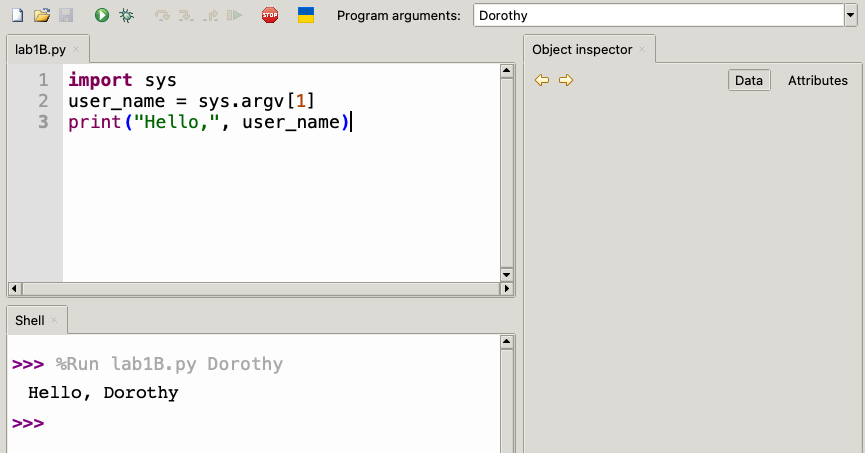
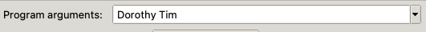

% CSCI 141 - Lab 1
% Caroline Hardin
% Winter 2026

##### Goals

* Practice writing and running Python programs in Python using the Thonny IDE
* Get used to accessing user input from (a) prompts using the `input` function, and (b) program arguments using `sys.argv`.

## Introduction and Preliminaries

The purpose of this lab is to give you some hands-on practice writing Python programs in Thonny, and get accustomed to two ways of accepting input from a user of your programs. The lecture videos about what programming is about and shows a few examples of very short Python programs. In this lab, you'll expand on upon these examples.

Since there's a wide variety of backgrounds in this class, everyone will progress at different speeds through this lab - that's ok! Most students should have enough time to complete the lab assignment during the lab session, but if you do not, be sure to upload your submission to Canvas by the due date. If you have questions, be sure to ask the TA. Ask questions often. Labs are your opportunity to get personalized help!

### A Note on Notation

There are two basic fonts in use in this document (this is common to many other help documents and computer books you will use). One is the font that I have used so far in this document; the second is `this font`, which is a fixed width font that I will use to denote exact things you should type, exact names of menus to use, website addresses and so on. Sometimes you'll see this displayed as a code block like this:

``` python
import sys
print(sys.argv[1])
```

We will also occasionally use angle brackets to indicate a placeholder that you should replace; for example, if you see `print("My name is <name>")`, you should replace `<name>` (including the angle brackets) with your name.

### Using the CS Labs

**For Labs 1 and 2 you are required to work on the CS lab computers and write your code in Thonny.** You will be taking your exams in this environment, so we want to make sure you know your way around before the stakes are high. After the lab period, you may work on your own machine. For labs 3 and onward, you may also work on your own machine if you prefer.

You will log into the CS labs with your Western username and password. The CS Computer Labs are separate from general university computer labs, and are managed by the CS department for use by our students - that's you! The labs that this class is scheduled in are running the Linux operating system, which may be different from what you're used to. Most basic functions will be similar to Mac or Windows, but if you're having trouble getting something done, please ask the TA. 

These machines are all set up with the software you'll need - in our case, Thonny. They're also set up so that you can store things in your home directory and access them regardless of which lab computer you're logged into. You can read more about this here: [https://support.cs.wwu.edu/home/survival_guide/day_to_day/Accounts_Passwords_and_Profile_Storage.html](https://support.cs.wwu.edu/home/survival_guide/day_to_day/Accounts_Passwords_and_Profile_Storage.html).

##### Create a folder for CSCI 141

Open the file browser and create a `csci141` folder to store your work for this class (I recommend avoiding spaces in the names of files and directories - this will keep things simple later). Inside that folder, make a `lab1` folder to store your work for this lab.

## Getting Started with Thonny

We’ll use Thonny as our IDE; it's already installed on the lab machines. You can download it for free from http://www.thonny.org if you'd like to install it on your own system - it's equally easy to set up on Windows, Mac, and Linux. If you want to use it on your own computer, you can download it for free from http://www.thonny.org. 

Search for and start Thonny using the search box at the bottom left. If there are multiple versions, use the most recent version that is installed. If you’ve launched Thonny correctly, a screen similar to what is shown below should appear. Don’t worry if the version number after ”Python” in the Shell tab differs; as long as the major (first) version number is 3, you’re in good shape.


There are two different ways that Thonny can be used. You can use the interpreter (or shell; the lower pane) directly, which will cause each line of code that you type into the Shell section to be executed after you press return, or you can use the editor (upper pane) create and save a python program to a file, and then run (execute) the file in its entirety. Because you'll be submitting your python programs via Canvas, all instructions in labs and homework assignments will ask you to save a python program to a file.

Select New from the File menu, which will open a new file. Then select Save As from the file menu, and save your file as `lab1A.py`  in your `lab1` folder.

As a first step, you'll recreate the quintessential Hello World program that we saw in class. An important of programming well is placing comments throughout your code to document your work. Comment lines among python code are ignored and not executed when the program is run. To insert a comment, begin the line with a pound symbol `#`. You saw in lecture how to use the `print` function to output text to the console.

## Hello World

Type the following into the editor window of python (edit your file) the following (use your name and the current date):

      # Author: Ada Lovelace
      # Date: April 1, 2025
      # Description: A hello world program for CSCI 141 Lab 1
      print("Hello World")

Notice how the IDE colors different parts your code differently. Comments are grey, and the words *Hello World*, which are enclosed in double quotes, are colored green, to signify that those words are a string literal. You'll learn more about strings later in the course, but now just think of it as text: the double quotes tell Python that what's inside them shouldn't be interpreted as more code, but as a piece of data representing some text.

That's it - you've written a Python program. It contains comments (which will be ignored by the python interpreter), and a single call to the `print` function, which will print the phrase Hello World to the console.

Save your program to your `lab1` folder (File -\> Save as\..., or Ctrl+S), then run the program by either selecting Run Current Script from the Run menu, clicking on the green circle with the right-pointing arrow (I call this the Friendly Green Run Button), or press the F5 button on your keyboard. If your code has no syntax errors, you should see something similar to the following:


## `lab1A.py`: Using`input`, `len`, and Variables

One important feature of most programs is that they somehow interact with the user and allow the user to input data. The `input` function in Python is one way to accomplish this: the program to prompts the user and then waits for some input to be entered using the keyboard.

We can call `input` function with no arguments to effectively pause the program until the user presses enter, as in

```python
input()
```

If we provide a string as an argument to `input`, it will print the string as a prompt before waiting for input.

Once the user provides input, you'll often want the program to to store whatever the user entered somewhere in memory so that you can refer to that data when needed. Programming languages rely on variables as place holders that "remember" where a piece of data is stored in the computer. The concept of a variable will be discussed extensively in lecture. For the time being, think of a variable as an easy-to-remember name for a piece of data. To set the value of a variable use the assignment operator, `=`. To remind yourself that `=` means the variable on the left gets set to the value on the right, pronounce `=` as 'gets'.

You've learned the basic use of two functions so far: `input` and `print`. Here's another one: the `len` function, which is short for *length*, calculates the length (number of characters) of its argument (i.e., whatever is inside the parentheses to the right of `len`).

Add the lines of code below to your python program. Type the text exactly---double quotes, commas, parentheses, line breaks, etc. -- all of it:

```python
  name = input("What is your name? ")
  name_length = len(name)
  print("Hello", name)
  print("You have", name_length, "characters in your name.")
```

When executed, the four lines of code print to the console `What is your name?`, and then wait for the user's input. Once the user provides input and presses return (enter), then the user's input is placed into the variable `name`. The `len` function is invoked to calculate the length of the data in the variable `name`. The output of the `len` function is placed into the variable `name_length`. The second-to-last `print` function causes the program to print the phrase `Hello` followed by the value that is stored in the variable `name`. Lastly, the count of characters in the user's name (as calculated by the `len` function) is also output to the console.

Run your program. If your code has no syntax errors, you should get something like this:

## Errors

Learning how to code means being able to find and fix syntax errors. Moreover, even if your python code has correct syntax, there may be other errors that may cause the program to crash. Knowing how to read error messages is an important skill because they inform you where in the code there is an error.

In this section, you'll introduce some syntax errors on purpose to get familiar with what you'll see when something goes wrong. Intentionally change `print` to `printt`, or `len` to `LEN`, or omit the parentheses around *What is your name* in the call to the `print` function. Any of these will generate an error when the program is run.

Save and run your program, and look at the red error message. A sample output is shown below. Assuming you had mistyped your code unintentionally, what information does the error message provide that you can use to troubleshoot your code? Notice that the error message tells you what line of code has the problem. Moreover the python interpreter tells you what exactly on a specific line of code it could not understand.

{#fig:error width="50%"}

Play around with small modifications to your code and get a feel for the different error messages. There are many, many rules about what is valid Python syntax. You will see lots of examples of correct Python code (and you'll encounter your fair share of incorrect code, as well!), but many questions are best answered by trying things out. Get creative about adding or removing spaces and newlines, changing capitalization, and so on.

When you get an error message, pay close attention to how to interpret what the error messages say about *where* the error is coming from. This will come in very useful later, when you need to locate an error you've made unintentionally! You'll also notice that Thonny provides some helpful suggestions for locating the error in the Assistant panel on the right.

Before moving on, make sure you've fixed any errors you introduced and your program works as described above.

## `lab1B.py`: Workig with Command Line Arguments

We've seen how to ask the program's user to provide input using the `input` function, which returns a value of type `str` containing whatever the user entered. In this section, we'll see another way to get input from a user by having our program take **command line arguments**; these are also sometimes known as **program arguments**, or **system arguments**.

In this lab, we'll demonstrate how to pass command line arguments into a Python program using Thonny; in the next lab, you'll see how to run Python programs with arguments from the Linux command line (whence command line arguments get their name).

Command line arguments are specified in Thonny using the "Program arguments" field in the top right corner of the IDE window:




1. If you don't see it there, you'll need to enable it. Go to the View menu and check the "Program Arguments" option.

2. Now, create a new file and save it as `lab1B.py`. In this file, type the following:

  ```python
  import sys
  user_name = sys.argv[1]
  print("Hello,", user_name)
  ```

3. In the program arguments box, write a name of your choosing, then run the program. You should see something like the following:

   

   A few things to notice here:

   * The line `import sys` at the top of the program is needed to be able to access the command line arguments. It is standard practice to put all `import`s at the top of your program (but below the comment with author/date/description).
   * The unfamiliar expression `sys.argv[1]` contains whatever value you typed in the program arguments box.
   * When running the program, the Thonny Shell shows the line `%Run lab1B.py Dorothy`. If you were to type this again, it would have the same effect as typing Dorothy in the Program arguments box and hitting the Run button.

4. Try removing the text from the Program arguments box and running the program. You should get an error saying `IndexError: list index out of range`, because your program referred to an argument that was not provided.

5. If more than one argument is given, you may be able to guess how we access it: `sys.argv[2]` refers to the second argument specified, `sys.argv[3]` for the third, and so on. Try changing your program to say hello to two people:

   ```python
   import sys
   name1 = sys.argv[1]
   name2 = sys.argv[2]
   print("Hello,", name1, "and", name2)
   ```

   Then run your program with two names in the program arguments box, separated by a space, like this:

   

   Now the program prints `Hello, Dorothy and Tim`.

   Command line arguments are a little less flexible than using the `input` function because the program can't interactively ask the user for inputs. However, it can be more convenient to take input this way, especially when you're running a program over and over again while testing it: you can simply repeat the same command without having to type the input again.

6. One more thing to know about program arguments is that, just like the result of a call to the `input` function, they are **always** strings (i.e., have type `str`). Try changing your program to take one argument, add 3 to it, and print the result:

   ```python
   import sys
   number = sys.argv[1]
   print(number + 3)
   ```

   Try running this - it throws an error, because `number` is a string and `3` is an integer; Python doesn't know how to add them together. Fix this by using the `int` function to convert the argument to an integer before adding 3 to it and printing the result.

7. Make sure your program works as intended, and add a comment at the top with Author, Date, and Description. Here are a few sample runs for `lab1B.py`:

   ```
   >>> %Run lab1B.py 15
   18
   ```

   ```
   >>> %Run lab1B.py 1
   4
   ```

   ```
   >>> %Run lab1B.py -10
   -7
   ```

## `lab1C.py`: An Adder Program

In another Python file named `lab1C.py`, write a program that prints the sum of two integers given as command line arguments. Here are some example runs of such a program:

```
>>> %Run lab1C.py 1 4
5
```

```
>>> %Run lab1C.py 6 -6
0
```

Make sure your program works correctly and has the customary Author, Date, and Description comment at the top.

## Submission

Before you submit, make sure all three of your programs work correctly and do not throw errors on valid input (they will throw errors if the user doesn't supply valid input). Then, upload `lab1A.py`, `lab1B.py`, and `lab1C.py` to the Lab 1 assignment on Canvas. For this lab, Canvas has been configured to permit only `.py` submissions.

## Rubric

This lab is graded out of 10 points.

* 3 points: The top of each program file contains a comment including author, date, and description

* 2 points: `lab1A.py` prints the correct output
* 2 points: `lab1B.py` prints the correct output
* 3 points: `lab1C.py` prints the correct output
