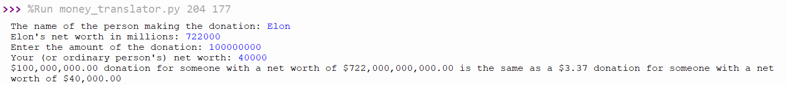

% CSCI 141 - Lab 2
% Caroline Hardin
% Winter 2026

##### Goals

* Become familiar with the basics of navigating the Linux command line
* Know how to run a Python program on the command line, including passing command line arguments
* Begin thinking about readability and making judicious use of comments
* Write two slightly larger, nontrivial programs

## Overview

This lab introduces you to the Linux command line, commenting and coding style, and asks you to write two slightly more involved programs. Upload your submission to Canvas before the deadline. If you have questions, be sure to ask the TA. Ask questions often. Labs are your opportunity to get personalized help!

## Linux Command Line Basics

**Important:** Follow the steps below, and feel free to explore further in the process. At the end of this section, you will show your terminal to the TA to demonstrate that you have completed these steps.

Windows, Mac OS, and Linux all provide graphical interfaces such as those you're used to using, that allow you to open programs and accomplish tasks using the mouse, icons, windows, and so on. All of these operating systems also provide another way of interacting with them, called a *Command Line Interface* (CLI). Although there is a steeper learning curve for knowing how to accomplish things using the command line, for certain tasks it can be more powerful once you know how to use it.

In this lab, you will learn the very basic elements of how to interact with the Linux command line and learn how to run Python code without the help of an IDE such as Thonny. What you will learn here is only a tiny fraction of the commands available; you can find a helpful \"cheat sheet\" of many commonly used Linux commands [here](linuxref.pdf) if you'd like to learn more.

1. Begin by opening a command line window (also called a Terminal). Click on the App icon in the lower left corner and type terminal to initiate a search; click on the Terminal icon from the results to launch a new terminal window. You can also quickly open a terminal by presing Ctrl+Alt+T.

2. In the terminal, you'll see a **prompt** that ends with a `$` sign. This is called the command line, or command prompt; you'll type commands here to interact with the system. Commands that you issue are interpreted by a program called a shell. The default shell, or command line language on the lab machines  is called `bash`; it is one of the many shells available in Linux.

3. You’ll notice that the `$` is prepended with your username and an `@` followed by the name of the computer that you are logged into. For example, `lovelace@cf162-03:~$` specifies the user `lovelace` logged into the `cf162-03` machine.

4. Anything you can do with the mouse when interacting with a windows environment you can also accomplish via the command line. In the following steps you will create a new directory (folder), navigate into that folder, and run a Python file, using only the command line. For these instructions, code and/or sample file content or output are displayed in code blocks like the one below. Type commands EXACTLY as they provided, and press return/enter to issue the command. For example:

   ```
   whoami
   ```

   is instructing you to type the command `whoami` on the command line and execute it by pressing return/enter. Try it out. What does this command do?

5. The terminal keeps track of a "working directory". When you open a fresh terminal, this is your home directory. You can see the current working directory with the `pwd` command (the "p" stands for "present"):

   ```
   pwd
   ```

   For Ada Lovelace, this command outputs `/home/lovelace`, her home directory.

6. List the files in your home directory with the `ls` (short for "list") command. Check to make sure your `csci141` folder from Lab 1 is there.

7. Commands can take arguments, similarly to how functions in Python take arguments, except here they are not surrounded by parentheses. Let's move into your `csci141` directory using the `cd` (short for "change directory") command:

   ````
   cd csci141
   ````

   You can now verify with `pwd` that you've moved into (in my case) `/home/<your_username>/csci141`.

8. Use `ls` to confirm that this directory has your `lab1` folder from Lab 1 in it.

9. Let's create a`lab2` folder. To create a directory, use the `mkdir` command with a single argument that is the name of the directory (folder) that you want to make. Create the directory `lab2`:

   ```
   mkdir lab2
   ```

10. Confirm that you have made your directory using `ls`. Now, `lab1` and, `lab2` should be there.

11. Enter the `lab2` directory:

    ```
    cd lab2
    ```

12. Use the `cp` (short for "copy") command to copy your `lab1C.py` program from your `lab1` folder into your `lab2` folder:

    ```
    cp ../lab1/lab1C.py .
    ```

    A few things to notice here:

    * `../` means "the parent directory of the current one"
    * `.` means "the current directory"

13. Moving or renaming files are done using the same command - `mv`. Let's rename the copy of `lab1C.py` in the `lab2` folder to `adder.py`:

    ```
    mv lab1C.py adder.py
    ```

14. Print out the contents of `adder.py` with the `cat` command:

    ```
    cat adder.py
    ```

15. Just as you can run a Python program using Thonny by pressing the green Run button, you can also run a program from the command line. In the terminal window (make sure you are in your `lab2` folder, which contains your Python program), run the `adder.py` program by invoking the python interpreter, with the command line arguments after the name of the program:

    ```
    python3 adder.py 10 2
    ```

    You should see the output of your program (ideally `12`) printed out to the terminal. 

16. **This step is a part of the grade for this lab.** Get your TA to confirm that you've successfully run your program from the command line. If you weren't able to do this during the lab period, take a screenshot of your terminal window and submit it with your other code files for Lab 2. You can take a screenshot using the screenshot button (camera icon) in the system menu at the top right of the screen.

## Commenting and Code Style

It's important to write code that is as **readable** as possible. Good style choices and judicious use of comments can help a reader understand your code. More often than you'd think, that reader is you! You'll get a better feel for good style as you gain experience, but here are some guidelines to get you started:

- Include a comment with the author, date, and a short description at the top of each .py file
- Don't try to accomplish too many things in a single line
- Find a balance between overly verbose code (i.e., unneccessarily long) and code that is so short as to be cryptic
- Use white space (blank lines) to chunk your code into logical sections
- Within your code, include comments when it helps with readability; for example,
  - Sometimes, it helps to have a comment for each logical section of code explaining its overall purpose
  - Sometimes, a line is particularly non-obvious and it's worth a comment explaining what it does and why

These rules are quite subjective and you'll need more experience before you can apply them well. For now, keep these things in mind, do your best, and feel free to ask for advice from more experienced programmers.

For all the labs in this course, commenting and code style is a portion of the rubric. With the exception of requiring the Author/Date/Description comment at the top, we will only take points off for fairly severe style issues.

## Broken Calculator

To help you practice your understanding of operators and operands, in this section you will solve the following programming problem: **The period key on your keyboard is broken, but you would like to multiply two numbers with a decimal digit.**

Let's look at an example of how this could work before we start writing any code. Suppose you want to calculate $20.4 \times 17.7$, but can only enter $204$ and $177$. The desired result is $361.08$. If the user inputs the values 204 and 177, how can you convert them to 20.4 and 17.7? By using the modulo and integer division operators! For example, 204 modulus 10 has a remainder of 4, which gives the decimal value .4, while 204 integer division 10 gives 20, which is the number before the decimal in 20.4.

**The Math:** Suppose that for the input values 204 and 177 you have successfully extracted the whole and decimal values (i.e., 20, 4, 17 and 7). How can you calculate the result of 20.4 x 17.7? Multiplication of decimal values requires you to sum the following four parts:

-   The first integer times the second integer

-   The first integer times the second decimal

-   The first decimal times the second integer

-   The first decimal times the second decimal

Notice that for each decimal, we also multiply in a factor of 0.1 to make sure that it is correctly weighted in the final product. In our example, the calculation looks like this: 

20.4 * 17.7 =  (20*17)
              +  (20 * 7 * 0.1)
              +  (4 * 0.1 * 17)
              +  (4 * 0.1 * 7 * 0.1)
              =  340 + 14 + 6.8 + 0.28
              = 361.08 


1.  Download [broken_calculator.py](broken_calculator.py)  and save it to your `lab2` folder.

2.  That file is incomplete. Only two lines of code have been written, which you are not allowed to edit. The rest are comments. Lines of code that say `# COMPLETE THE CODE` you will need to write. Read the comments for each section to get a sense of what code you need to write. Also, the number of COMPLETE THE CODE comments in that file is how many lines of python code I wrote in my solution. It's okay if your solution uses fewer lines of code, or more, but each block of code should accomplish what the comment above it specifies.

    **For the lines of code that you write, you are only allowed to use the `print` function, the assignment operator, and the following mathematical operators. You may not use `float()`, nor `int()`, or `/`.**

    -   `//`

    -   `%`

    -   `*`

    -   $+$

3.  There are 7 parts to the code, labeled A through G. Here are hints for each of them:

    -   **A:** This requires a single use of the print function

    -   **B:** Use only the `//` and `%` operators. Follow the logic in the description above

    -   **C:** This requires a single use of the print function

    -   **D:** Do the same for the second integer as you did for the first integer (step B). Use only the `//` and `%`operators

    -   **E:** The same as step C, but for the second integer

    -   **F:** Use the Hint above for explanation on how to do this

    -   **G:** This requires a single use of the print function.

**In your python code, you CAN make use of periods, but when the program is RUN, the user CAN ONLY enter integer (non decimal) numbers.**

Here's a sample run of the completed code:


## Money Translator
We've been reading in the news about celebrities, philanthropists, and CEOs who are donating their wealth. You can see examples of some of the stories online [[https://news.google.com/search?q=Billionaire%20donated&hl=en-US&gl=US&ceid=US%3Aen ]]. You may wonder how generous a million dollar donation _actually_ is for someone with, for example, a billion dollars? 

In this assignment, we'll create a money translator to translate the donation to the same percent of net worth as an ordinary person. 

To do the calculation, you'll enter as user input the name of the donor, the size of the donation, the net worth of the donor (in millions), and the net worth of an average person. You can see examples of average net worth at https://wallethacks.com/average-net-worth-by-age-americans/ . 

Next, you divide the donation by the donors net worth, to get the percent of their money they donated. Multiple that by the average person's net worth to get an equivalent donation, as seen below:

scaled_donation = (donation\donators_net_worth) *  average_net_worth

It would be more fair to calculate the generosity of a donation as a percent of disposable income - after all, 1\% of your income when you're eating instant ramen is not the same as 1\% of your income when you have four mansions. For a rough approximation we'll use the US federal poverty level to stand in for 'minimum needed to survive' - set at  $15,650 for an individual in 2026. The calculation then would be updated to be:

scaled_donation = (donation\(donators_net_worth - fed_min)) *  (average_net_worth - fed_min)

Write a program called `money_translator.py` that asks the user for the four pieces of input, and then outputs the result of the calculation. To help avoid the automated tests failing due to simple typing errors, I've provided most of the text output in the comments. I've also provided you the final output text which will work as long as you use the same variable names.

Here's a sample invocation of the program:



#### Test Cases

You can check your program's correctness by making sure it matches the output for the test cases in the table below. To help the amounts display nicely as numbers, be sure that `format_as_money.py' is in the same folder as your code.

|    Net worth of donor in millions  | Donation amount |  Average net worth  | Scaled donation amount |
| ----- | -------- | -------- | --------- |
|   1 | 100 |  100,000 | $8.76     |
|    .2     | 1000 | 80,000  | $356.26   |
|    240,000 | 5,000,000 |  40,000  | $0.34   |

If you find it tedious to type in the amounts while testing, you may wish to substitute in command line arguments during the development, and switch that out for the input statements after it's working.

This is an example of using Python to do something interesting: many of us and our friends and family have been _far_ more generous than the donations which make headlines! A fun conversation starter to pull up next time you're watching the news.

To complete this project, you'll need to use \ttt{input()}, \ttt{int()}, \ttt{float()}, \ttt{print()} with \ttt{end} settings,

## Submission

Upload the following files to Canvas:

-   `broken_calculator.py` 

-   `money_translator.py`

-   (if the TA has not checked in lab already) A screenshot showing your terminal window having run `adder.py` from your `lab2` directory using the command line.


## Rubric

This lab is graded out of a total of 10 points:

* 2 points: you successfully ran your renamed `adder.py` program from Lab 1 from the Linux command line
* 3 points: `broken_calculator.py` works as expected while only using the `%`, `//`, $+$ and $*$ operators
* 3 points: `money_translator.py` produces the correct output
* 2 points: Both files have a comment at the top and follow good coding practices

