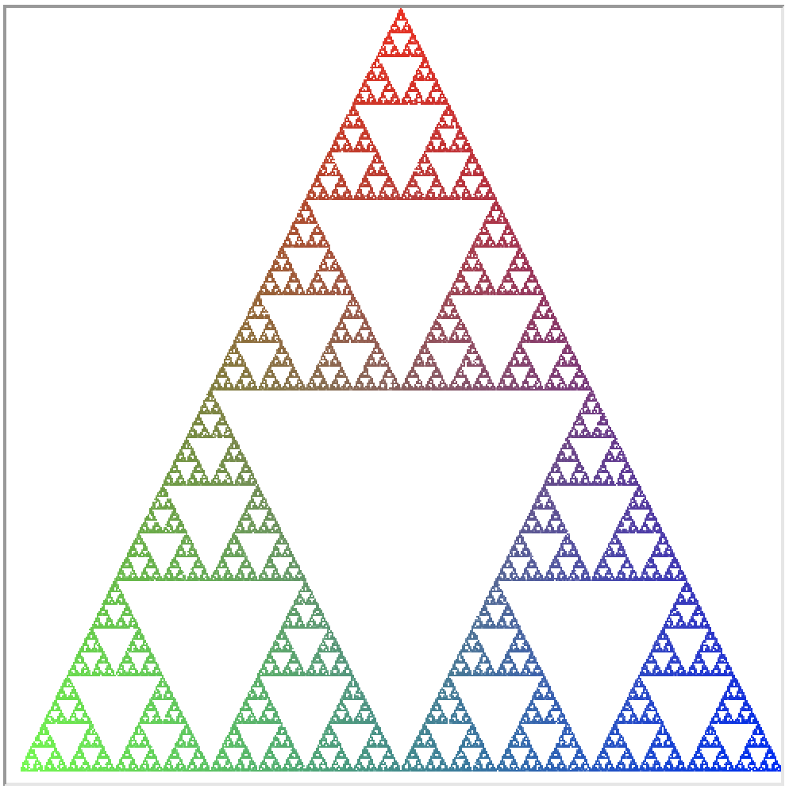
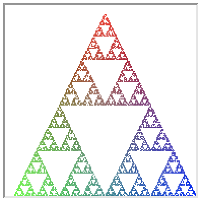
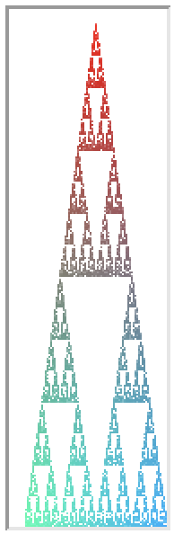
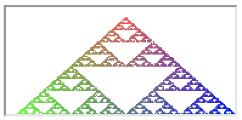

% CSCI 141 - Lab 6
% Scott Wehrwein
% Fall 2025

**Goals**

* Practice breaking a problem into smaller, simpler steps
* Practice using functions to manage complexity when implementing a complicated algorithm
* Draw a nifty picture using a surprising algorithm

## Overview

For this lab you will write a Python program that draws a Sierpinski Triangle like the one pictured below using a method called a "chaos game". A chaos game is an example of what's called a **zero-player** game, so called because we set things up a certain way to start, and the "game" unfolds deterministically based on a set of rules - there are no players involved.

The chaos game is played as follows. The user specifies the window size (say $300$ by $300$ pixels). Denote the three corners of a triangle $1,2,3$, where corner $1$ is at the top center of the screen, corner $2$ is in the lower left of the screen, and corner $3$ is in the lower right of the screen.

First, a corner of the triangle is chosen at random. Then, at each step of the game, a dot is drawn at the midpoint between the current location (where the prior dot was drawn) and a randomly-chosen corner of the triangle. Here's some pseudocode to help you understand how the chaos game works:

    p = a random corner of the triangle
    loop 10000 times:
        c = a random corner of the triangle
        m = the midpoint between p and c
        choose a color for m
        color the pixel at m
        p = m

This process will generate a Sierpinski Triangle like the one pictured below.
{width="4in" height="4in"}

## Details

### Skeleton Code {#skeleton-code .unnumbered}

You are provided with a skeleton code file [sierpinski.py](sierpinski.py) containing some code to help get you started, including a function that sets up the Turtle graphics window for our somewhat nontraditional turtle use case. Read through the skeleton code. You need not understand every detail of the code I've written, but you must **carefully read and understand the specification for the** `turtle_setup` **function**: this takes care of creating a turtle, resizing the window to the desired dimensions, and several other details that I don't want you to have to write the code for. Your code should call `turtle_setup` function before beginning the chaos game iterations, and proceed to use the turtle it returns to do all your pixel coloring.

The `turtle_setup` function changes the window so its coordinate system now has (0,0) at the bottom left corner (instead of the default, with (0,0) in the center. The positive $x$ axis points right and positive $y$ axis points up, so the top left corner is at (`0, canv_height`), the bottom right corner is at (`canv_width, 0`), and the top right is at (`canv_width, canv_height`). This helps to simplify the math when locating corners of the triangle. The setup function also calls `tracer(0, 0)`, which you may recall disables automatic re-drawing of the canvas. This means that to get your picture to show up, **you need to call `turtle.update()`** yourself. For the sake of speed, I recommend re-drawing the picture only every 100 or every 1000 iterations so the drawing doesn't take too long.

### Coloring Pixels with Turtles {#coloring-pixels-with-turtles .unnumbered}

In this program, we're not really using turtles for what they were meant for. Instead of drawing lines as the turtle moves, we'll use the turtle to color individual pixels on the canvas. Turtles draw as they move, but they can also stamp shapes, such as circles and dots; we'll make use of the aptly named `dot` method. To fill in a pixel, all you need to do is move the turtle to that pixel, then draw a dot of size 1. If nothing shows up when you use a dot size of 1 (this seems to happen on some Windows systems), using a dot size of 2 is also fine.

When the turtle draws via movement with the pen down, or via other methods such as `dot`, the color it draws is determined by the turtle's current color. You can change the turtle's current color using the (again, aptly named) `color` method. One way to specify colors is using various standard color names (`"red", "green", "purple"`, etc.). A more flexible way is to specify how much red, green, and blue you want: some combination of these three primary colors can represent all colors that your screen can display. When storing images on computers, we typically store each R,G, and B value using a single byte (8 bits). That means a color is represented by three numbers from 0 to 255, which is the maximum number representable using 8 bits. For instance $(255,0,0)$ is red, $(0,255,0)$ is green and $(0,0,255)$ is blue. Furthermore, $(255,255,255)$ is white and $(0,0,0)$ is black.

In the figure at the top of this writeup, you can see that the colors of the pixels are related to their coordinates. If you simply followed the pseudocode at the top of this document, but chose black for the color every time, then you'd have a black and white version of the Sierpinski triangle. Once you have that working, you should figure out how to make the triangle more colorful. The color scheme used in the example above chooses each color value based on the distance from one of the corners. In particular, the red color scales from 255 to 0 based on distance from corner 1, the green scales with distance from corner 2, and blue scales with distance from corner 3. You may choose a different scheme, but your colors should have the following properties:

-   Each corner is a visibly distinct color from the other two
-   The colors blend smoothly across the triangle

Make sure your color scheme satisfies these constraints even when the window dimensions are not square.

## Suggested Approach

This may seem like a big problem to solve all at once; in fact it is. A good strategy for tackling a big problem is to turn it into a collection of small ones: break the problem down into small pieces, write functions to solve each piece, then put them together into a solution to the full program.

1.  In L12B, I wrote a `midpoint` function. This will come in handy, so I've included in the skeleton.

2.  I included the pseudocode for the chaos game in the skeleton file. This is a handy way to keep track of your overall program structure: start with pseudocode and piece-by-piece fill in code that accomplishes each of the steps. Because each step has some complexity to it, **I recommend defining a function that takes care of the details of each step**. That way, the code in your main program will end up corresponding fairly closely to the lines of the pseudocode, and it will be easy to understand.

3.  Based on the pseudocode, decide what functions you'd like to have in order to make the algorithm easy to implement. In my solution, I have almost one-to-one correspondence between functions and lines in the pseudocode. To give one example, to choose a color for the point `m`, I have a `choose_color` function. It takes a point and the three corners and calculates the RGB color values based on distance of the point from each of the colors. This function in turn makes use of another function that calculates the distance between two points.

4.  Instead of immediately starting to code each function you've decided to write, try this instead: write out the specification (docstring) for the function. This means deciding what the function takes as arguments and what it returns. Once you have this, try sketching out the code for the chaos game, using the functions (even though you haven't written them yet!). In doing this, you may discover changes that you want to make to your function specifications---make them now so you don't have to rewrite the code.

5.  Now, go implement each of your functions. Start with the ones that will be needed to draw the triangle in black. After finishing one function, **test it**. Use the interactive shell and/or put code in your main program that checks whether the code does what you expect it to. For example, to test my `choose_color` function, I first tried passing in each corner: I made sure the top corner gave me $(255, 0, 0)$ back, and so on for all three corners. Then I tried the bottom middle point on the canvas, because it's easy for me to calculate that its blue and green values should be about 128 (it's equidistant from the green corner and the blue corner). Then test the center point - its RGB values should all be equal because it's equidistant from all three corners.

6.  Finally, turn your sketch of the overall chaos game algorithm into real code that uses your functions to draw the Sierpinski triangle. Make sure it works with different square window sizes first (e.g., 200 by 200, 300 by 300). Then try testing it with unequal width and height (e.g., 200 by 300).

<!-- the prior version of this (used to be A4) had a section on testing that asked them to write some bespoke unit tests. One day, something like this needs to be brought back in this lab or elsewhere. For now, I'm removing it to keep the size of this lab manageable. -->

## Hints

1.  I defined three variables in my main program that hold the coordinates of the three corners, since the corner coordinates are needed in several places. The functions that do calculations involving corners need to take the relevant corners as parameters.

2.  Drawing a black and white triangle is a great first step. I recommend choosing black as the color for all pixels to ensure the geometry is all working correctly before getting into the color logic.

3.  The midpoint function we wrote in class used tuples to pack the coordinates of points together into a single argument / return value. This is a design decision, and you may choose to use this approach in your functions or not. For example, my function that colors a certain pixel a given color has the following header:

         color_pixel(turt, point, color)

    where `point` is expected to be a 2-tuple `point = (x, y)`, and `color = (r, g, b)` is a 3-tuple of the RGB color values. I could also have written it

          color_pixel(turt, px, py, r, g, b)

    but I think it's slightly cleaner to pass points and colors to functions as tuples.

4.  How solidly filled in your triangle is depends on how many iterations of the chaos game you run and how large your canvas is. A smaller canvas has fewer pixels to fill in, so fewer iterations will make a more solid picture, but it will have lower resolution. A large picture requires more iterations but has higher definition. Feel free to experiment with running more iterations to get larger, higher-definition triangles, but **please turn in code that runs 10000 iterations and runs in less than 5 seconds.** To keep things fast, remember that you can choose how often to call `turtle.update()`; for maximum speed, call it only once after all your iterations are complete. The images below show what you can expect your drawing to look like with 10000 iterations for a few different canvas sizes.

Here's a 200x200 output:
{width="30%"}


Here's a 100x300 output:
{width="10%"}

Here's a 200x100 output:
{width="30%"}

## Guidelines

Please make sure your program follows these guidelines:

-   Your code should run 10000 iterations of the chaos game and run in under 5 seconds.

-   Your functions should not directly make use of (refer to) any global variables. Any information a function needs to do its job should be passed into the function as a parameter.

-   Your code should do all the drawing (i.e., color all pixels) with the `Turtle` object returned by the setup function. Don't create any additional turtles.

-   Each of your functions, and the main program, should not be too long. Not counting comments, docstrings, and blank lines, my main program (the part in the `if __name__ == "__main__":` block) is just under 20 lines and each of my functions is less than 10 lines. If you find yourself writing a continuous block of code that's longer than about 30 lines (not counting comments and blank lines), think about how you could break it up into logical subtasks and write functions to accomplish each one.

-   Your functions and variable names should be descriptive but not overly long. For example, your corner 1 variable should probably not be called `c1`, nor should it be called\
    `the_top_middle_corner_of_the_triangle`. Somewhere in between is best.

## Submission

Take a screenshot of the drawing produced on a canvas with **width = 140, height = 320**, and name it `triangle.png`. Submit `triangle.png`, `sierpinski.py` to the Lab 6 assignment on Canvas.

## Rubric

This assignment is worth a total of 10 points.

**Correctness**

* 4 points: The triangle is drawn correctly for a square window
* 3 points: The triangle is drawn correctly for a non-square window
* 2 points: Each corner is a visibly distinct color as described above
* 1 points: The colors gradually blend across the triangle

**Possible deductions:**

* File is missing a comment at the top stating author, date, and purpose
* Inadequate or inappropriate use of comments, poor variable naming, or other coding style issues
* Program does not defines at least two additional functions beyond the provided setup and midpoint functions.
* Functions are missing docstrings containing a clear function specification.
* Functions make reference to global variables.
* Main program or individual function(s) are excessively long.

* Missing screenshot submission

## Challenge Problem

Take a look at the following web page: `http://mathworld.wolfram.com/ChaosGame.html`. There you can see how what we're doing here is just one specific case of a general idea. The general idea is you can have triangles, squares, pentagons, hexagons, etc. And you when you choose a random corner and find the midpoint you could instead find the point that is $1/3$ of the way to the corner, or $3/8$ of the way to the corner, etc. Make a copy of your main assignment program in a file named `chaos.py`. In this file, implement the following function:

```python
def chaos_game(canv_width, canv_height, poly_sides, ratio):
    """ Run a chaos game on a canvas with size (canv_width, canv_height)
        with n = poly_sides (i.e., a poly_sides-sided polygon)
        and  r = ratio (i.e., fraction of distance from the corner)
    """
```

This challenge may require usage of material we haven't covered in detail (for example, lists will likely come in handy to store the corners of the polygon). If you are trying to tackle this and encounter any problems, come talk to me and I'd be happy to help. Successful completion of the challenge problem is worth up to 1 point of extra credit. Submit `chaos.py` to the Lab 6 assignment on Canvas.
